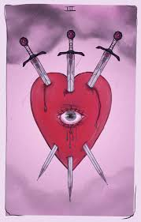

# THREE OF SWORDS

July 1984
London
‘C’mon, Matt, get in there. This little lot has cost me a fucking
mint so far!’
Matt swallowed hard. He was bricking it, but then why wouldn’t
he? Andy and the others may have had little concern about
performing in front of a crowd, in fact as far as they were concerned
it was all part of the night's entertainment. But now that it was his
turn he was wondering if this was such a good idea after all. Initially,
when Andy had suggested it, it had excited him to the point of
euphoria, promising to be one of the best nights of his life. But now
the night had finally arrived, he was suffering from a huge dose of
the jitters and not because of what his fiancée Lindsay may have
thought.

He hadn’t given her a single thought all evening. What he was
worried about was having to perform in front of this lot, all of his
best mates. It was bad enough that the few girlfriends he had had to
date, had laughed when he had whipped out his equipment and held
it at them like some inadequate garden hose. Lindsay had done the
same until she showed him the ropes. So the thought of acting out
his little fantasy in front of Andy and the crew was softening him by
the second, but he knew they would crucify him if he backed out
now. Andy wasn’t a complete bastard he reasoned, he had some hope, 
with him being best man and all. After all, hadn’t he gone and
organised this whole event just for him, promising him the night of
his dreams? Well in fairness to Andy, he had delivered his end of
the bargain, so now finally it was his turn, and knowing Andy he
would expect wholehearted participation. Willingness to partake was
not the problem, it was the audience that was causing him distress as
he knew they would rip his performance apart.
Now that the weekend had arrived, he wanted to make sure he
would remember this night for the rest of his life. After all, he
needed some sweetener for putting up with the last two years, never
mind getting shackled to Lindsay till death they do part. He loved
her, that wasn’t the issue, but had to admit he had been far more
excited about this night than the big day next week. And to be honest
who could blame him.
Lindsay and her friends had had a field day choosing that
organza, this lilac, that lace. He had been bored to tears by the whole
marriage malarkey. So when Andy said he was organising a stag to
remember, he knew Andy would deliver. And in fairness he hadn’t
let him down. Asking straight up what he wanted, what was his
treat...no strings, no dramas. And he told him...he wanted a red-head.
And not your run-of-the-mill "bottle red" types either. He wanted the
real McCoy.
He had always wanted to taste red and up until now never quite
had the opportunity. Lindsey, though pretty in her own way, didn’t
quite have the "three amigos" as he liked to call them...tits, legs and
ass, she also didn’t have the red hair he fantasized so much about.
But even so, he could still rise to the occasion when needed. Make
no mistake, his Lindsey was lovely, but she had smaller tits than a
robin, shorter legs than his Nan’s VCR stand, and a nose that entered
the room before the rest of her face caught up.
So he wanted his final unmarried shag to be momentous and
absolutely unforgettable. How else was he going to perform for the
foreseeable with Lindsay, without this sweet little memory to get
him through the years ahead? And now that the moment had finally
arrived he wanted to savour every moment of it. Watching the
creamy-skinned red-head sprawled on the bed, thighs apart, large
breasts poured into a tiny green satin bra, he let his hungry eyes
devour the image. He couldn’t wait to taste her. Slowly at first,
before pumping her long and hard. First though, he had to get rid of
Andy and the others. Besides, they had had the other girl to entertain 
them most of the night, and now it was his turn. Granted, the darkhaired 
one was prettier than the red head, with her long black hair,
hanging down the length of her back and the bluest eyes he had ever
seen, but she was sallow and tit-less, just like his Lindsay. Definitely
not his type.
‘Well,’ Andy elbowed him, ‘what you waiting for?’
‘Andy, mate, I was wondering...?’
‘Fuck's sake, mate...what?’
‘I’d kind of like to be alone with her...get me?’
‘What...and ruin our fun?’ he laughed.
‘Nah, mate, just fancy a proper bit, on me own. What you
reckon?’
Andy looked at him suspiciously, before letting the smile curve
his lips.
‘Course, mate, no problem. I’ll get rid of the lads...give you some
space,’ he winked.
‘You’re a, mate,’ Matt nodded, feeling happier. At least now he
could really enjoy his little red-head without any interference or pisstake. 
Watching his friends leave, Matt held his breath until the door
closed after them. Finally he was alone with her. He could see the
brunette laid out, asleep or high, he couldn’t decide which. But the
red-head was still wide awake smiling benignly at him. Tearing off
his clothes, he climbed onto the bed and knelt on all fours over her
naked body.
As she lay beneath him, he reached out to touch the hair falling in
and around her face. Her creamy-white skin, soft yet supple against
the inside of his thighs caused him to harden. It was a lust he had
never felt with Lindsay, and it overwhelmed him, bringing a hungry
smile to his thin wet lips. Finally, his moment had arrived, he was
about to taste a real red-head, once and for all, and he had no
intention of waiting a single second more. As he closed his eyes with
the exquisite taste of anticipation moistening his mouth, he thrust
forward penetrating her fast and urgently just as the door burst open. 

