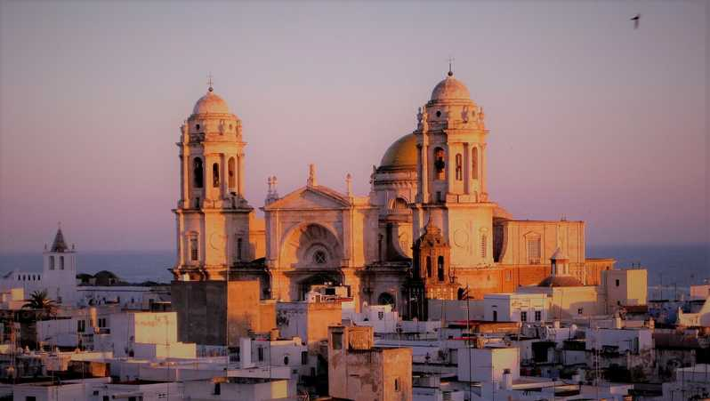

# THE NARRATIVE OF ALVAR NUÑEZ CABEZA DE VACA

In some respects the journey of Alvar Nuñez Cabeza de
Vaca and his three companions overland from coast to
coast during the eight years from 1528 to 1536 is the most
remarkable in the record of American exploration, and as a
narrative of suffering and privation the relation here
presented perhaps has no equal in the annals of the northern
continent.
The author of the narrative was a native of Jeréz de la
Frontera, in the province of Cadiz, in southern Spain, but
the date of his birth is not known. 

His father was Francisco
de Vera, son of Pedro de Vera, conqueror of the Grand
Canary in 1483; his mother, Teresa Cabeza de Vaca, who
also was born in Jeréz. Why Alvar Nuñez assumed the
matronymic is not known, unless it was with a sense of
pride that he desired to perpetuate the name that had been
bestowed by the King of Navarre on his maternal ancestor,
a shepherd named Martin Alhaja, for guiding the army
through a pass that he marked with the skull of a cow
(cabeza de vaca, literally "cow's head"), thus leading the
Spanish army to success in the battle of Las Navas de 
Tolosa, in July, 1212, which led up to the final conquest of
the Moors in Spain.
Having returned to Spain after many years of service in the
New World for the Crown, Pámfilo de Narvaez petitioned
for a grant; and in consequence the right to conquer and
colonize the country between the Rio de las Palmas, in
eastern Mexico, and Florida was accorded him. The
expedition, consisting of six hundred colonists and soldiers,
set sail in five vessels from San Lucar de Barrameda, June
17, 1527, and after various vicissitudes, including the
wreck of two ships and the loss of sixty men in a hurricane on 
the southern coast of Cuba, was finally driven northward by 
storm, and landed, in April, 1528, at St. Clements Point, near the entrance to
Tampa Bay, on the west coast of Florida. Despite the
protest of Cabeza de Vaca, who had been appointed
treasurer of Rio de las Palmas by the King, Narvaez
ordered his ships to skirt the coast in an endeavor to find
Pánuco, while the expedition, now reduced to three
hundred men by desertions in Santo Domingo, death in the
Cuban storm, and the return of those in charge of the ships,
started inland in a generally northern course. The fleet
searched for the expedition for a year and then sailed to
Mexico.
Among the members of the force, in addition to Alvar
Nuñez Cabeza de Vaca, were Andrés Dorantes de
Carrança, son of Pablo, a native of Béjar del Castañar, in
Estremadura, who had received a commission as captain of 
infantry on the recommendation of Don Alvaro de Zúñiga,
Duke of Béjar; Captain Alonzo del Castillo Maldonado, of
Salamanca, the son of Doctor Castillo and Aldonza
Maldonado; and Estévan, or Estévanico, a blackamoor of
Asemmur, or Azamor, on the west coast of Morocco, the
slave of Dorantes. With the exception of those who
returned with the ships, these four men were the only ones
of the entire expedition who ever again entered a civilized
community.
Pursuing a generally northerly course, harassed by Indians,
and beset with hunger, illness, and treachery in their ranks,
Narvaez's party finally reached the head of Appalachee
Bay, in the country of the Indians after whom this arm of
the Gulf of Mexico takes its name. Looking now to the sea
as his only means of escape; Narvaez the incompetent, with
neither the proper materials nor the mechanics, set about to
build boats to conduct his men out of their trap—craft that
were expected to weather such tropical storms as they had
already so poorly buffeted with their stouter ships.

